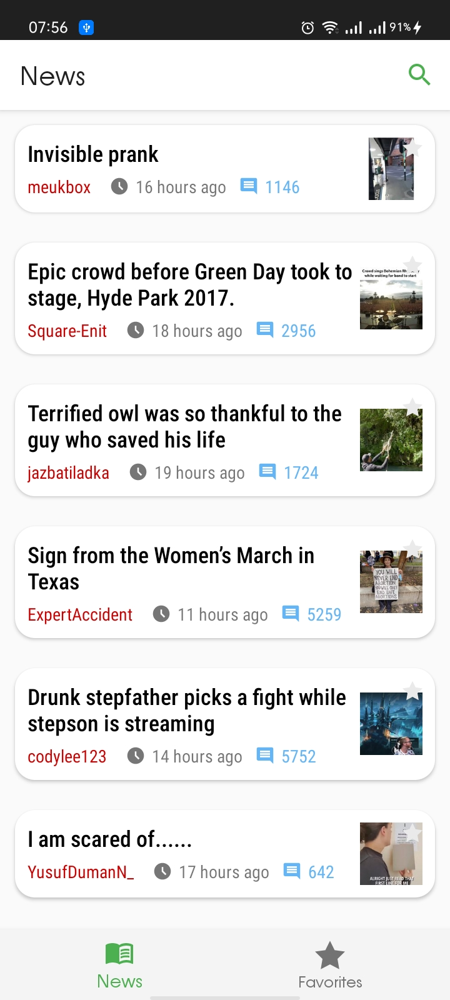
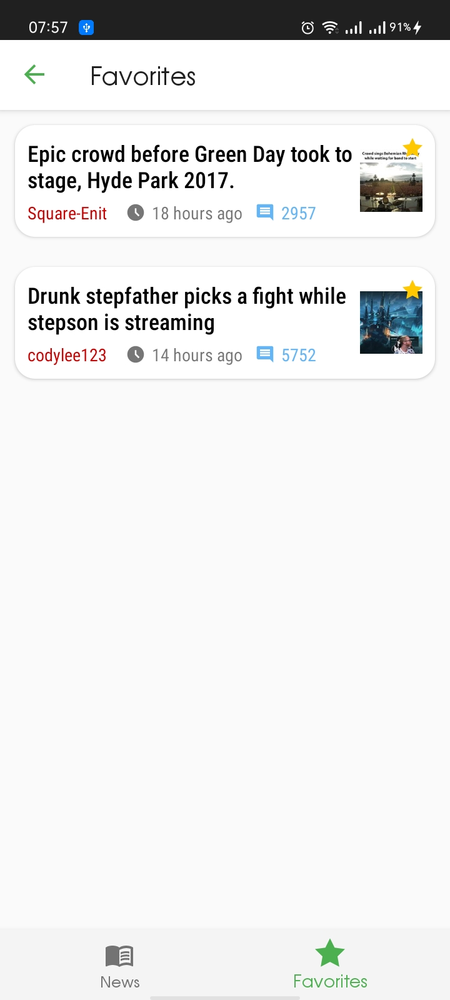

# RedditNews
===================

A simple application to display the top news from the [Reddit API](https://www.reddit.com/top) site and save your favorites to a local database.

### Architecture

* MVVM + Repository pattern - [Guide to app architecture](https://developer.android.com/jetpack/guide)
* Kotlin

### Preview

### Libraries

* Dagger 2
* Retrofit2 & OkHttp3
* Room
* Paging
* RxJava2
* Coil
* Navigation Component
